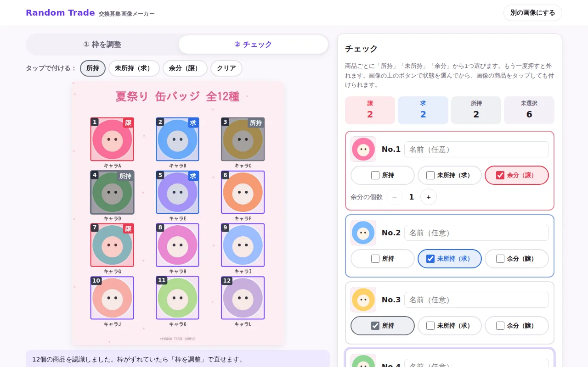
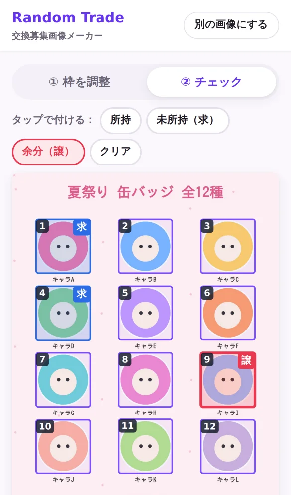
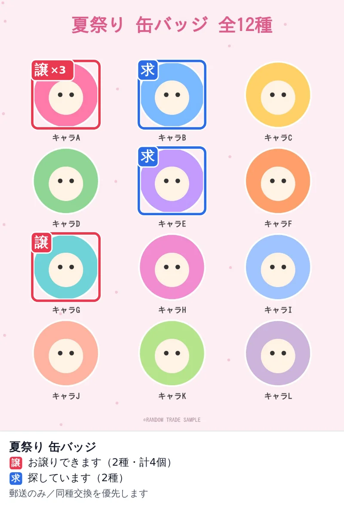

# Random-Trade

**公式のランダム商品のラインナップ画像から、「譲」「求」入りの交換募集画像を作る Web アプリ**

最初に募集文（ヘッダ・補足・ハッシュタグ）を決めておき、ラインナップ画像をアップすると、商品を自動で見つけて枠で囲みます。商品ごとに「所持」「未所持」「余分」をチェックして「画像を出力」を押すと、余分の商品に **譲**、未所持の商品に **求** のマークが付いた画像と、そのまま貼れる募集文ができます。

| 作業画面（PC） | スマホ | 出力画像 |
| --- | --- | --- |
|  |  |  |

> 画像はお使いの端末の中だけで処理され、サーバーには送信されません。

## できること（MVP）

- **募集文の設定**：公演・イベント・アーティストごとに、ヘッダ・補足・ハッシュタグを最初に決める。画像を差し替えても引き継ぎ、この端末に保存されるので次回もそのまま使える
- **画像のアップロード**：選択、ドラッグ＆ドロップ、貼り付け
- **商品の自動認識**：背景と商品の色の違いから、商品を1つずつ枠で囲み、左上から順に番号を振る
- **枠の補正**：感度を変えて再認識、グリッド（行×列）で分割、ドラッグで追加・移動・リサイズ、削除
- **チェック入力**：商品ごとに「所持」「未所持（求）」「余分（譲）」のチェックボックス。画像をタップしてまとめて付けることもできる。余分の個数や商品名も入れられる
- **画像を出力**：元の画像に譲・求のマークだけを描いた PNG を保存・共有（文字は画像に入れない）
- **募集テキスト**：ヘッダ＋「【譲】No.1×2、No.7」「【求】No.2」＋補足＋ハッシュタグの本文をコピー

## ドキュメント

| 文書 | 内容 |
| --- | --- |
| [企画書](docs/01-proposal.md) | 背景、課題、ターゲット、コンセプト、差別化、KPI、リスク、ロードマップ |
| [要件定義書](docs/02-requirements.md) | スコープ、ユーザーフロー、機能要件・非機能要件、出力画像とテキストの仕様、受け入れ基準 |
| [MVP 設計書](docs/03-mvp-design.md) | 技術構成、状態管理、認識アルゴリズム、描画、テスト、要件との対応 |

## 開発

Node.js 22 以降が必要です。

```bash
npm install
npm run dev        # 開発サーバー（http://localhost:5173）
npm test           # 単体テスト
npm run lint       # oxlint
npm run typecheck  # TypeScript の型チェック
npm run build      # dist/ に静的ファイルを出力
npm run check      # lint・型チェック・テスト・ビルドをまとめて実行（コミット前に実行）
```

GitHub Actions は使っていないので、コミット前に手元で `npm run check` を実行してください。

## GitHub Pages で公開する

ビルド済みのファイルを `docs/app/` に置き、`docs/` をそのまま Pages で配信します（Actions は不要です）。

1. アプリを変更したら `npm run build:pages` を実行し、`docs/app/` の変更もコミットする
2. リポジトリの **Settings → Pages** で、**Source** を「Deploy from a branch」、**Branch** を公開したいブランチの `/docs` にする
3. `https://<ユーザー名>.github.io/Random-Trade/` を開く（`docs/index.html` から `app/` に移動します）

`base: './'` にしているので、Vercel や Netlify など、ほかの静的ホスティングにもそのまま置けます。

## 技術スタック

TypeScript / React / Vite / Vitest / oxlint。画像処理は Canvas 2D API と自前の実装で、外部の画像処理ライブラリは使っていません。

## 利用上の注意

公式画像の権利は権利者にあります。権利者のガイドラインと SNS の規約に従ってご利用ください。
