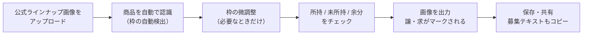
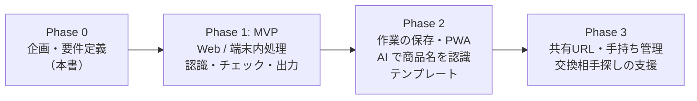

# 企画書：Random-Trade（ランダム商品の交換募集画像メーカー）

| 項目 | 内容 |
| --- | --- |
| 文書種別 | 企画書 |
| 版 | v0.1（MVP 着手版） |
| 作成日 | 2026-09-26 |
| 関連文書 | [要件定義書](./02-requirements.md) / [MVP 設計書](./03-mvp-design.md) |

---

## 1. 一言でいうと

**公式のラインナップ画像をアップして、タップでチェックするだけで「譲／求」入りの交換募集画像ができるWebアプリ。**

> アップする → 商品が自動で枠取りされる → 「持ってる／持ってない／余ってる」をチェック → 「画像を出力」

---

## 2. 背景

### 2.1 推し活とランダム商品

- アイドル・アニメ・ゲーム・VTuber などの「推し活」が広がり、グッズ購入が日常になっている。
- 缶バッジ、アクリルスタンド、ブロマイド、トレーディングカード、ラバーストラップなど、**どの絵柄が出るか分からない「ランダム商品（ブラインド商品）」**が定番になっている。
- ランダム商品は構造的に「推し以外が当たる」「同じ絵柄が重複する」ため、ファン同士の**交換（トレード）**がセットで発生する。

### 2.2 いまの交換募集のやり方

X（旧Twitter）などの SNS で、次のような投稿がよく見られる。

1. 公式が出している**ラインナップ画像（全絵柄の一覧）**をスクリーンショットする
2. 画像編集アプリで、余っている商品に「**譲**」、欲しい商品に「**求**」と1つずつ書き込む（丸で囲む・スタンプを置く・持っているものを塗りつぶす など）
3. 「#〇〇交換」などのハッシュタグと一緒に投稿する

> ※ 市場規模や交換投稿数などの定量データは、次フェーズで別途調査する（TODO）。

---

## 3. 解決したい課題

| # | 誰の課題 | 課題 | 具体例 |
| --- | --- | --- | --- |
| 1 | 募集する人 | **画像の加工が面倒** | 20種類のうち8種類に1つずつスタンプを置き、位置やサイズを合わせる |
| 2 | 募集する人 | **状況が変わるたびに作り直し** | 交換が1件成立するたびに、最初から加工し直す |
| 3 | 募集する人 | **スマホだけで作りにくい** | 細かい作業が小さい画面ではつらい |
| 4 | 見る人 | **どれが譲／求か分かりにくい** | 人によって書き方がばらばらで、小さい文字や薄い丸は見落としやすい |
| 5 | 両者 | **テキストだけの募集はミスが出る** | 「No.3 と No.8 が譲」と書くと番号を取り違えやすく、見た目も伝わりにくい |

---

## 4. ターゲット

### 4.1 メインペルソナ

- **Aさん（20代・会社員）**
  - アニメとアイドルのファン。イベントやくじで同じシリーズを5〜10個まとめて買う
  - 余った分は X で交換相手を探す。**作業はスマホだけ**
  - 困りごと：加工アプリでの作業に毎回10分以上かかる。交換が成立するたびに作り直すのが面倒

### 4.2 サブペルソナ

- **Bさん（10代後半・学生）**：初めて交換に挑戦する。「譲／求」の書き方の定番が分からない
- **Cさん（30代・収集家）**：複数シリーズを並行して集めていて、手持ちの管理もしたい（将来の機能で対応）

---

## 5. 解決策（コンセプト）

### 5.1 コンセプト

**「アップして、タップして、出力するだけ」**
画像加工の作業をなくし、**1分以内**に見やすい交換募集画像を作れるようにする。

### 5.2 利用の流れ

### 5.3 主な機能

| 機能 | 説明 | MVP |
| --- | --- | --- |
| 画像アップロード | ファイル選択、ドラッグ＆ドロップ、貼り付け | ○ |
| 商品の自動認識 | 画像内の商品を1つずつ枠で囲む | ○ |
| 枠の補正 | グリッドでの分割、手動の追加・移動・サイズ変更・削除 | ○ |
| チェック入力 | 各商品に「所持」「未所持（求）」「余分（譲）」をチェック。画像を直接タップしてもチェックできる | ○ |
| 画像を出力 | 譲・求を色付きの枠とバッジでマークした画像を作る。凡例やタイトルも入れられる | ○ |
| 保存・共有 | PNG で保存、スマホの共有シートから SNS に送る | ○ |
| 募集テキスト生成 | 「【譲】No.3 / 【求】No.1」のような本文を作ってコピー | ○ |
| 商品名の自動認識 | AI で画像内のキャラ名などを読み取る | 将来 |
| 作業の保存 | 途中の状態や手持ちを保存し、次回はチェックを直すだけにする | 将来 |
| テンプレート | マークのデザインや配色を選べる | 将来 |

---

## 6. 既存手段との比較・差別化

| 手段 | 良い点 | 弱い点 |
| --- | --- | --- |
| 汎用の画像加工アプリ | 自由に加工できる | 手作業が多く、作り直しの手間が大きい |
| テキストだけの募集 | すぐ書ける | 視覚的に伝わらず、番号の取り違えも起きる |
| 交換マッチング型のサービス | 相手が見つかりやすい | 会員登録が必要で、SNS での募集文化とは別の場所になる |
| **Random-Trade（本企画）** | **公式画像をそのまま使い、タップだけで作れる。登録不要で端末内で完結する** | 背景が複雑な画像では自動認識の精度が落ちる（→ グリッド分割と手動補正で補う） |

**差別化のポイント**

1. **公式ラインナップ画像への「マーク付け」に特化**：SNS で定着している投稿形式をそのまま効率化する
2. **登録不要・端末内処理**：画像をサーバーに送らないので気軽に使える。プライバシーと権利の面でも安全寄りになる
3. **作り直しが一瞬**：チェックを変えて再出力するだけ

---

## 7. 目標指標（KPI 案）

| 区分 | 指標 | MVP での目標（仮） |
| --- | --- | --- |
| 体験 | アップロードから画像出力までの時間 | 中央値 60 秒以内 |
| 体験 | 自動認識の成功率（補正なしで全商品を枠取りできた割合） | 単色背景・格子状の画像で 80% 以上 |
| 利用 | 画像出力数 / 週 | リリース後に基準値を測る |
| 継続 | 再訪率（7日以内） | リリース後に基準値を測る |
| 拡散 | 出力画像経由の流入（フッターのクレジットなど） | 将来、クレジットを入れるかどうか検討 |

> MVP ではサーバーを持たないので、計測には外部のアクセス解析を入れる必要がある。プライバシー方針とあわせて次フェーズで検討する。

---

## 8. マネタイズ（将来の案）

MVP は無料で公開し、使われるかどうかの検証を優先する。将来の候補は次のとおり。

- 広告（出力画面の周辺のみ。作業の邪魔をしない）
- プレミアム機能（テンプレートの追加、作業の保存と複数シリーズの管理、AI での商品名認識）
- ※ 金銭のやり取りを仲介する機能は持たない（転売の助長を避けるため）

---

## 9. リスクと対策

| リスク | 内容 | 対策 |
| --- | --- | --- |
| 権利 | 公式画像は権利者のもの | 画像は**端末内だけで処理し、サーバーに保存・公開しない**。利用上の注意で、権利者のガイドラインと SNS の規約に従うよう案内する |
| 転売の助長 | 高額転売に使われる | 「交換」に特化し、価格を入れる欄や決済機能を持たない |
| 認識精度 | 背景が柄物・グラデーションだと枠取りに失敗しやすい | 感度調整、グリッド分割、手動補正の3段構えにする。将来は AI 認識も併用する |
| 端末差 | 古いスマホやブラウザで動かない | 対応ブラウザを決め、出力画像の最大サイズに上限を設ける |
| 継続利用 | 1回使って終わりになる | 将来、作業の保存や手持ち管理で「再出力が一瞬」という体験を作る |

---

## 10. ロードマップ

| フェーズ | ゴール | 主な内容 |
| --- | --- | --- |
| Phase 0 | 何を作るかを決める | 企画書・要件定義書・MVP 設計書 |
| Phase 1（MVP） | 「1分で交換画像ができる」を検証する | 自動認識、枠の補正、チェック入力、画像出力、テキストコピー |
| Phase 2 | 続けて使う理由を作る | 作業の保存、ホーム画面への追加（PWA）、AI での商品名認識、デザインテンプレート |
| Phase 3 | 交換の成立までを助ける | 募集の共有URL、手持ち・欲しい物リストの管理、交換相手探しの支援 |
