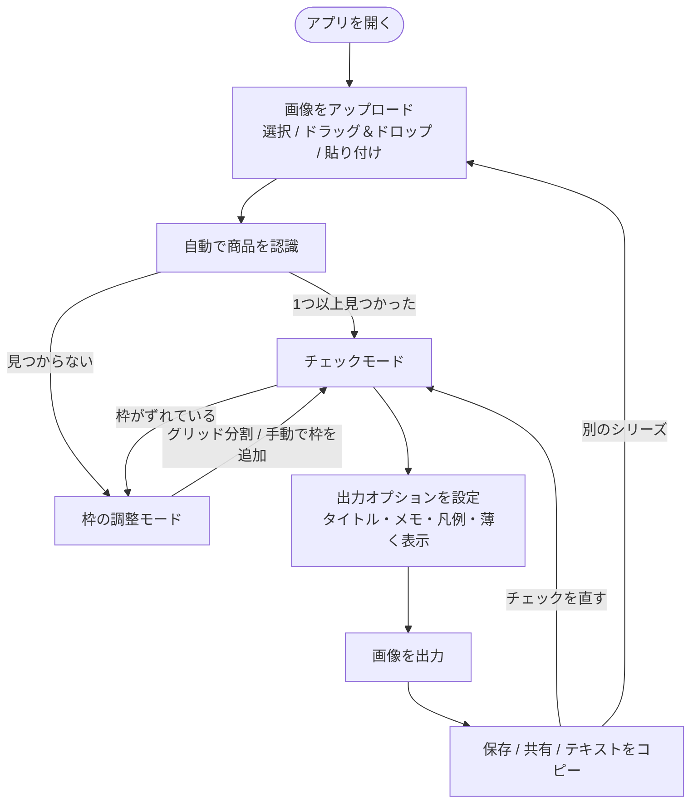

# 要件定義書：Random-Trade MVP

| 項目 | 内容 |
| --- | --- |
| 文書種別 | 要件定義書 |
| 版 | v0.1（MVP） |
| 作成日 | 2026-09-26 |
| 関連文書 | [企画書](./01-proposal.md) / [MVP 設計書](./03-mvp-design.md) |

---

## 1. 目的とスコープ

### 1.1 目的

ランダム商品の公式ラインナップ画像から、**「譲（余分）」「求（未所持）」がひと目で分かる交換募集画像**を、スマホだけで1分以内に作れるようにする。

### 1.2 MVP のスコープ

| 対象 | 対象外（将来） |
| --- | --- |
| 1枚の画像のアップロード | 複数画像の結合 |
| 商品の自動認識（位置の検出） | 商品名（キャラ名など）の自動認識 |
| 枠の補正（グリッド分割・手動編集） | 背景色のスポイト指定、枠の一括整列 |
| 所持／未所持／余分のチェック入力 | 手持ちの在庫管理、複数シリーズの管理 |
| マーク入りの画像の出力と保存・共有 | デザインテンプレートの切り替え |
| 募集テキストの生成とコピー | SNS への直接投稿、交換相手とのマッチング |
| ブラウザだけで動くこと（サーバー不要） | ログイン、クラウド保存、作業の保存 |

---

## 2. 用語

| 用語 | 意味 |
| --- | --- |
| ラインナップ画像 | 公式が公開している、ランダム商品の全絵柄を並べた画像 |
| 商品（アイテム） | ラインナップ画像の中の1つの絵柄 |
| 枠 | 画像の中で1つの商品が写っている範囲を示す矩形 |
| ステータス | 商品ごとのチェック状態。`未選択`・`所持`・`未所持`・`余分` の4つ |
| 譲 | 余分に持っていて、交換に出せる商品。ステータス `余分` の商品 |
| 求 | 持っていなくて、交換で欲しい商品。ステータス `未所持` の商品 |
| 出力画像 | ラインナップ画像に譲・求のマークを描いた画像 |
| 募集テキスト | 譲・求の商品を列挙した、SNS 投稿用の本文 |

---

## 3. 利用者と利用環境

### 3.1 利用者

- 企画書の [4. ターゲット](./01-proposal.md#4-ターゲット) を参照。主な利用者は、**スマホだけで SNS に交換募集を出す人**。

### 3.2 利用環境

| 区分 | 対象 |
| --- | --- |
| スマートフォン | iOS Safari 16.4 以降、Android Chrome の最新2バージョン |
| PC | Chrome、Edge、Firefox、Safari の最新2バージョン |
| 画面幅 | 360px 以上 |
| ネットワーク | 最初の読み込みのみ必要。画像処理はすべて端末内で行う |

---

## 4. ユーザーフロー



---

## 5. 機能要件

優先度は MoSCoW で表す（**Must**：MVP に必須 / **Should**：MVP に入れたい / **Could**：余裕があれば / **Won't**：MVP では作らない）。

### 5.1 画像の入力

| ID | 機能 | 内容 | 優先度 |
| --- | --- | --- | --- |
| FR-01 | 画像の選択 | ファイル選択ダイアログで画像を1枚選べる。スマホでは写真ライブラリから選べる | Must |
| FR-02 | ドラッグ＆ドロップ | PC で画像ファイルをドロップして読み込める | Should |
| FR-03 | 貼り付け | クリップボードの画像を貼り付け（Ctrl/⌘+V）で読み込める | Could |
| FR-04 | 入力チェック | 画像以外のファイルや 30MB を超えるファイルは読み込まず、理由を表示する | Must |
| FR-05 | 画像の差し替え | 「別の画像にする」で最初からやり直せる | Must |

### 5.2 商品の認識と枠の補正

| ID | 機能 | 内容 | 優先度 |
| --- | --- | --- | --- |
| FR-10 | 自動認識 | 画像を読み込んだら、商品を自動で検出して枠を付け、番号（No.1〜）を振る。番号は左上から右へ、上の段から下の段への順にする | Must |
| FR-11 | 認識結果の通知 | 見つかった数を表示する。0件のときは、グリッド分割か手動追加を案内する | Must |
| FR-12 | 感度の調整 | 感度（0〜100）を変えて再認識できる。すでにチェックが入っているときは、上書きしてよいか確認する | Should |
| FR-13 | グリッド分割 | 行数と列数（各 1〜20）を指定すると、画像を均等に分割して枠を作る。自動認識の枠があるときはその外側の範囲を、ないときは画像全体を分割する | Must |
| FR-14 | 枠の追加 | 枠の調整モードで、画像の何もない所をドラッグすると枠を追加できる | Must |
| FR-15 | 枠の移動・サイズ変更 | 枠をドラッグすると移動、右下のハンドルをドラッグするとサイズを変えられる | Must |
| FR-16 | 枠の削除 | 選択中の枠を削除できる（枠の × ボタン、パネルのボタン、Delete キー）。すべての枠をまとめて削除できる | Must |
| FR-17 | タッチ操作 | FR-14〜16 はマウスとタッチの両方で操作できる | Must |

### 5.3 チェック入力

| ID | 機能 | 内容 | 優先度 |
| --- | --- | --- | --- |
| FR-20 | チェックボックス | 商品ごとに「所持」「未所持（求）」「余分（譲）」のチェックボックスを表示する。1つの商品で同時にオンにできるのは1つまで。オンの項目をもう一度押すと `未選択` に戻る | Must |
| FR-21 | 画像タップでの入力 | チェックモードでは、画像の上のパレットで状態（所持・未所持（求）・余分（譲）・クリア）を選び、画像の商品をタップしてまとめて付けられる。同じ状態をもう一度タップすると `未選択` に戻る | Should |
| FR-22 | 余分の個数 | `余分` の商品には個数（1〜99、初期値 1）を入力できる。2個以上なら出力とテキストに「×2」のように表示する | Should |
| FR-23 | 商品名 | 商品ごとに名前を入力できる。空欄のときは「No.番号」を表示名にする | Could |
| FR-24 | サムネイル | 一覧には、その商品の部分を切り抜いたサムネイルを表示する | Should |
| FR-25 | 集計表示 | 譲・求・所持・未選択の件数を表示する | Should |
| FR-26 | 選択の連動 | 一覧で選んだ商品は画像上でも強調する。画像上で選んだ枠は一覧でも強調する | Could |

### 5.4 出力

| ID | 機能 | 内容 | 優先度 |
| --- | --- | --- | --- |
| FR-30 | 画像を出力 | 「画像を出力」ボタンで、元の画像に譲・求のマークを描いた画像を作り、プレビューを表示する（仕様は [6. 出力画像の仕様](#6-出力画像の仕様)） | Must |
| FR-31 | 出力できない場合 | 譲・求が1つもないときはボタンを押せないようにし、理由を表示する | Must |
| FR-32 | タイトル・メモ | タイトル（例：作品名・グッズ名）とメモ（例：取引方法・連絡先）を入力して、出力画像の下部に入れられる | Should |
| FR-33 | 凡例 | 出力画像の下部に、譲・求の意味と種類数を入れられる（初期値：オン） | Should |
| FR-34 | 対象外を薄くする | 所持・未選択の商品を白っぽく薄くできる（初期値：オフ） | Should |
| FR-35 | 保存 | 出力画像を PNG で保存できる。ファイル名は `random-trade_YYYYMMDD-HHMM.png` | Must |
| FR-36 | 共有 | 端末が対応していれば、共有シートで画像を SNS などに送れる | Could |
| FR-37 | 募集テキスト | 譲・求を列挙した募集テキストを表示し、ワンタップでコピーできる（仕様は [7. 募集テキストの仕様](#7-募集テキストの仕様)） | Should |

### 5.5 MVP では作らない機能（Won't）

| ID | 機能 | 備考 |
| --- | --- | --- |
| FR-90 | 商品名の自動認識 | Phase 2。AI（マルチモーダル LLM）で画像内の文字を読み取る案 |
| FR-91 | 作業の保存・復元 | Phase 2。IndexedDB での保存を想定 |
| FR-92 | デザインテンプレート | Phase 2 |
| FR-93 | 共有URL・交換相手探し | Phase 3。サーバーが必要 |

---

## 6. 出力画像の仕様

### 6.1 レイアウト

```
┌───────────────────────────┐
│                           │
│   元のラインナップ画像    │  ← 元の解像度（長辺が 4096px を超える場合は 4096px に縮小）
│   ＋ 譲・求のマーク       │
│                           │
├───────────────────────────┤
│ タイトル（入力時のみ）    │  ← フッター（凡例・タイトル・メモのどれかがあるときだけ付ける）
│ ■譲 お譲りできます（3種） │
│ ■求 探しています（2種）   │
│ メモ（入力時のみ）        │
└───────────────────────────┘
```

### 6.2 マーク

| 対象 | 枠 | バッジ |
| --- | --- | --- |
| 余分（譲） | 赤 `#E8384F` の角丸の枠 | 枠の左上に赤地・白文字の「譲」。個数が2以上なら「譲×2」 |
| 未所持（求） | 青 `#2B6CE6` の角丸の枠 | 枠の左上に青地・白文字の「求」 |
| 所持・未選択 | 描かない | なし（「対象外を薄くする」がオンのときは、白を 60% 重ねる） |

- 枠の線の太さは、商品の短い辺の約 3.5%（最小 3px）。どんな背景でも見えるよう、枠の外側に白いふちを付ける
- バッジの大きさは、商品の短い辺の約 30%。出力画像の大きさに応じて最小値と最大値を設ける
- 色だけに頼らず、必ず「譲」「求」の文字を入れる（色覚の多様性に配慮）

### 6.3 形式

- PNG（透過なし、背景は白）

---

## 7. 募集テキストの仕様

```
{タイトル}              ← 入力したときだけ
【譲】No.1、No.3×2
【求】No.5、No.8
{メモ}                  ← 入力したときだけ
#{タイトル}交換         ← タイトルを入力したときだけ（空白は取り除く）
```

- 商品は番号の順に並べる。名前を入力していればその名前を使う
- 譲・求のどちらかが0件のときは、その行を「【譲】なし」のように出す

---

## 8. 非機能要件

| ID | 区分 | 要件 |
| --- | --- | --- |
| NFR-01 | 性能 | 自動認識は、一般的なスマホで 1 秒以内に終わる（解析用に画像を長辺 512px に縮小して処理する） |
| NFR-02 | 性能 | 12 メガピクセルの画像でも、出力が 3 秒以内に終わる |
| NFR-03 | プライバシー | 画像を外部に送らない。認識と出力はすべてブラウザ内で行う。解析やトラッキングのスクリプトは入れない（MVP） |
| NFR-04 | 可用性・運用 | 静的ファイルのホスティング（GitHub Pages、Vercel など）だけで動く。サーバーやデータベースは使わない |
| NFR-05 | 互換性 | [3.2 利用環境](#32-利用環境) のブラウザで動く。出力画像の長辺は 4096px までとし、スマホのキャンバスの上限を超えないようにする |
| NFR-06 | 使いやすさ | 初めての人が、説明を読まずに 60 秒以内に画像を出力できる。主なボタンは片手で押せる大きさ（高さ 44px 以上）にする |
| NFR-07 | アクセシビリティ | チェックボックスは本物のフォーム部品を使い、キーボードで操作できる。譲・求は色と文字の両方で表す |
| NFR-08 | 保守性 | TypeScript（strict）で書く。認識・出力・テキスト生成・状態管理のロジックは UI から分けて、単体テストを書く。コミット前に lint・型チェック・テスト・ビルドを行う（`npm run check`） |
| NFR-09 | 権利への配慮 | 画面に「公式画像の権利は権利者にあります。権利者のガイドラインと SNS の規約に従ってご利用ください」という注意書きを出す |

---

## 9. データ要件

MVP はデータを永続化しない（ページを再読み込みすると作業内容は消える）。画面内で持つデータは次のとおり。

| エンティティ | 項目 | 型 | 説明 |
| --- | --- | --- | --- |
| 画像 | url | string | 読み込んだ画像のオブジェクトURL |
| | width / height | number | 元の画像のピクセルサイズ |
| | name | string | ファイル名 |
| 商品 | id | string | 一意のID |
| | rect | {x, y, w, h} | 枠。画像サイズに対する割合（0〜1）で持つ |
| | name | string | 商品名（空欄可） |
| | status | `none` / `owned` / `wanted` / `extra` | 未選択 / 所持 / 未所持（求） / 余分（譲） |
| | extraCount | number | 余分の個数（1〜99） |
| 出力オプション | title / note | string | タイトル / メモ |
| | showLegend | boolean | 凡例を入れるか |
| | dimOthers | boolean | 所持・未選択の商品を薄くするか |

---

## 10. 画面要件

MVP は1画面で、状態に応じて表示を切り替える。

| ID | 画面・エリア | 主な要素 |
| --- | --- | --- |
| S-01 | アップロード | アプリ名、キャッチコピー、ドロップエリア兼ファイル選択ボタン、使い方（3ステップ）、権利の注意書き |
| S-02 | 画像エリア | ラインナップ画像と枠の重ね表示。枠には番号と状態を表示する。モード切替（枠の調整 / チェック）、チェックモードでは状態パレット |
| S-03 | 枠の調整パネル | 自動認識ボタン、感度スライダー、グリッド分割（行・列）、選択中の枠の削除、全削除、操作ヒント |
| S-04 | チェックパネル | 集計、商品一覧（サムネイル・名前・チェックボックス・個数） |
| S-05 | 出力パネル | タイトル・メモの入力、凡例・薄く表示のオプション、「画像を出力」ボタン、プレビュー、保存・共有ボタン、募集テキストとコピーボタン |

---

## 11. 受け入れ基準（MVP 完了の条件）

1. 白や単色の背景に商品が格子状に並んだ画像で、商品がすべて自動で枠取りされ、左上から順に番号が振られる
2. 自動認識がうまくいかない画像でも、グリッド分割か手動の枠追加で、すべての商品に枠を付けられる
3. スマホ（タッチ操作）で、枠の追加・移動・サイズ変更・削除ができる
4. 各商品に「所持」「未所持」「余分」のうち1つだけをチェックでき、もう一度押すと外せる
5. 「画像を出力」を押すと、余分の商品に赤い「譲」、未所持の商品に青い「求」のマークが付いた PNG ができ、保存できる
6. 募集テキストをコピーできる
7. 画像処理の間、外部へのネットワーク通信が発生しない
8. `npm run check`（lint・型チェック・単体テスト・ビルド）が通る

---

## 12. 制約と前提

- 公式画像の権利は権利者にある。本アプリは画像を端末内で加工する道具で、画像の配布や保存はしない
- 自動認識は「背景と商品の色の違い」を使う単純な画像処理で行う。柄物やグラデーションの背景では精度が落ちることを前提とし、グリッド分割と手動補正で補う
- iOS Safari では、保存時にダウンロードの代わりに画像のプレビューが開く場合がある。そのため、画像を長押しして保存する方法も案内する
