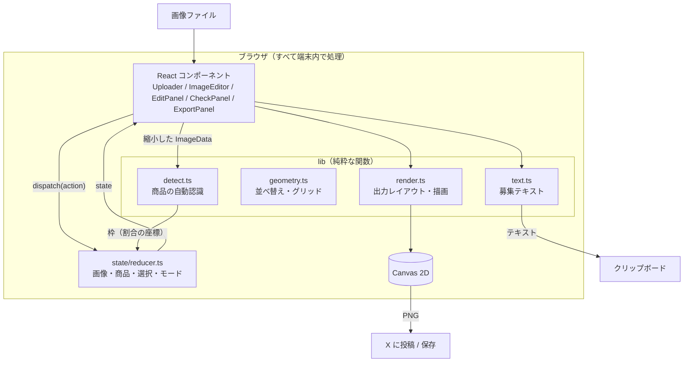
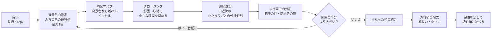

# MVP 設計書：Random-Trade

| 項目 | 内容 |
| --- | --- |
| 文書種別 | 設計書（MVP） |
| 版 | v0.1 |
| 作成日 | 2026-09-26 |
| 関連文書 | [企画書](./01-proposal.md) / [要件定義書](./02-requirements.md) |

---

## 1. 方針

- **サーバーを持たない**：画像の読み込み、商品の認識、出力画像の描画は、すべてブラウザの中で行う（NFR-03, NFR-04）
- **ロジックと UI を分ける**：認識・出力レイアウト・テキスト生成・状態遷移は React に依存しない純粋な関数として書き、単体テストで確かめる（NFR-08）
- **依存を増やさない**：実行時に使うライブラリは React だけ。画像処理（OpenCV など）も自前で実装し、読み込みを軽くする

## 2. 技術スタック

| 区分 | 採用 | 理由 |
| --- | --- | --- |
| 言語 | TypeScript（strict） | 型で座標系や状態の取り違えを防ぐ |
| UI | React 19 | 状態に応じた画面の切り替えが多いため |
| ビルド | Vite | 設定が少なく、静的ファイルとして出力できる |
| テスト | Vitest | Vite と設定を共有できる |
| Lint | oxlint | 高速。Vite のテンプレートの標準 |
| 画像処理 | Canvas 2D API ＋ 自前の実装 | 外部ライブラリなしで、端末内で完結させる |
| 枠の編集 | SVG ＋ Pointer Events | マウスとタッチを同じコードで扱える |

## 3. ディレクトリ構成

```
src/
├── App.tsx                 # 画面全体。状態（useReducer）と各パネルをつなぐ
├── main.tsx / index.css    # エントリーポイントとスタイル
├── components/
│   ├── Uploader.tsx        # S-01 アップロード（選択・ドロップ）
│   ├── ImageEditor.tsx     # S-02 画像と枠の重ね表示、枠の追加・移動・リサイズ、タップでのチェック
│   ├── EditPanel.tsx       # S-03 枠の調整（再認識・グリッド分割・削除）
│   ├── CheckPanel.tsx      # S-04 チェック（集計・商品一覧・チェックボックス）
│   ├── ExportPanel.tsx     # S-05 出力（オプション・プレビュー・X に投稿・保存・テキスト）
│   ├── labels.ts           # 画面の表示名
│   └── useElementWidth.ts  # 要素の表示幅を追うフック
├── lib/                    # UI に依存しないロジック（単体テストの対象）
│   ├── types.ts            # 型定義
│   ├── geometry.ts         # 矩形の計算、読む順の並べ替え、グリッド分割
│   ├── detect.ts           # 商品の自動認識
│   ├── render.ts           # 出力画像のレイアウト計算と描画
│   ├── text.ts             # 募集テキストの生成
│   ├── share.ts            # X への投稿（投稿画面の URL・文字数の目安・投稿方法の選択）
│   ├── postSettings.ts     # 募集文の設定の保存
│   ├── status.ts           # チェック状態の扱い
│   └── image.ts            # 画像ファイルの読み込み（ブラウザ専用）
└── state/
    └── reducer.ts          # 画面の状態と遷移
```

## 4. 全体構成



## 5. データと状態

### 5.1 座標系

- 枠（`Rect`）は**画像サイズに対する割合（0〜1）**で持つ。表示サイズ、解析用の縮小サイズ、出力サイズが違っても、同じ値を使い回せる
- 画面上の枠は、元画像と同じ大きさの `viewBox` を持つ SVG を `` にぴったり重ねて描く。線の太さは `vector-effect: non-scaling-stroke` で画面基準にそろえる

### 5.2 状態（`AppState`）

| 項目 | 説明 |
| --- | --- |
| `image` | 読み込んだ画像（オブジェクトURL、サイズ、`HTMLImageElement`） |
| `items` | 商品の一覧（`TradeItem[]`）。常に読む順（左上→右下）に並べ、配列の順番をそのまま No. にする |
| `selectedId` | 選択中の商品 |
| `mode` | `edit`（枠の調整） / `check`（チェック） |
| `nextId` | 商品 ID の連番 |

出力オプション（薄く表示）、状態パレットの選択、感度は、`App` のローカル状態として持つ。

募集文の設定（ヘッダ・補足・ハッシュタグ）も `App` のローカル状態として持ち、画像を差し替えても引き継ぐ。変わるたびに `lib/postSettings.ts` で localStorage に保存し、次に開いたときに読み込む。localStorage が使えない・中身が壊れているときは空の設定にして、その場の作業は続けられるようにする。

### 5.3 主なアクション

| アクション | 内容 |
| --- | --- |
| `imageLoaded` | 画像を差し替え、商品をリセットする |
| `replaceRects` | 認識結果やグリッド分割の結果で、商品を作り直す |
| `addItem` / `updateRect` / `removeItem` / `clearItems` | 枠の追加・変更・削除。追加と変更のあとは読む順に並べ直す |
| `toggleStatus` | チェックボックスとタップの両方で使う。押した状態がオンなら未選択に戻し、そうでなければその状態だけをオンにする |
| `setExtraCount` / `rename` | 余分の個数（1〜99）と名前 |

## 6. 商品の自動認識（`lib/detect.ts`）

ラインナップ画像は「単色に近い背景の上に、商品がすき間を空けて並んでいる」ことが多い。その性質を使った、軽い画像処理で認識する。



| 手順 | 内容 | 主なパラメータ |
| --- | --- | --- |
| 縮小 | 処理を速くするため、長辺 512px に縮小した `ImageData` を使う | `ANALYSIS_MAX_SIDE = 512` |
| 背景色の推定 | 範囲のふち（短い辺の 1% の帯）の色を 16 段階に丸めて集計し、多い色を背景色とする。2番目以降は全体の 15% 以上あるときだけ採用する（2色の背景やグラデーションへの対策） | 最大 3 色 |
| 前景マスク | どの背景色とも RGB の距離がしきい値より大きいピクセルを商品とみなす。透明なピクセル（alpha < 128）は背景 | しきい値 = `10 + (100 - 感度) × 0.4`（感度 50 で 30） |
| クロージング | 膨張→収縮で、商品の中の細い隙間（透明なアクリル部分など）を埋めて1つのかたまりにする。積分画像を使って O(画素数) で計算する | 半径 = 長辺 × 0.6% |
| 連結成分 | 8 近傍でつながったかたまりの外接矩形を求める。画像の 0.1% 未満の小さなかたまりは捨てる | — |
| すき間での分割（格子） | すき間の細いカードの並びは、クロージングやすき間をまたぐ透かし文字（「SAMPLE」など）で1つのかたまりになる。かたまりの中で列ごと（行ごと）の前景の割合を数え、上位 20% の値の 3 割以下になる「谷」で分ける（XY-cut）。1つの商品を誤って切らないよう、分けた断片の大きさの差が 1.5 倍以内のときだけ分け、行→列→…と最大 4 段まで入れ子に繰り返す | 断片の最小幅 = 長辺 × 2% |
| すき間での分割（商品名） | かたまりの上か下に、何も描かれていない行をはさんで、高さが本体の 25% 以下の帯があれば切り離す。切り離した帯（商品名などの文字）は、あとの外れ値の除去で捨てられる | — |
| 台紙の処理 | 範囲の半分より大きいかたまりは「商品をまとめて載せた台紙」とみなし、その内側で背景色を推定し直して再帰的に探す（最大 2 段）。内側で 2 個以上見つからなければ、背景を分離できなかったとして捨てる | `MAX_DEPTH = 2` |
| 統合 | 小さい方の面積の 30% 以上重なる枠を 1 つにまとめる | — |
| 外れ値の除去 | 縦横比が 6 を超える細長い枠を捨てる。さらに、面積が大きい方の半分の枠の中央値を「典型的な商品の大きさ」とし、面積が 20% 未満、または幅か高さが 45% 未満の枠を捨てる（タイトルや商品名の文字、ロゴ、コピーライト表記など） | — |
| 仕上げ | 商品のふちが切れないよう少し余白を足し、読む順（中心の高さの差が枠の高さの中央値の半分以内なら同じ段）に並べる | 余白 = 長辺 × 0.6% |

**処理時間の目安**：512×512px、36 個の商品で約 30ms（開発機の Node.js での測定）。台紙がある場合は内側を探し直すので 2〜3 倍になる。実際の公式ラインナップ画像（1080×1080px、14〜28 枚のカード）でも 20〜90ms。

**実画像での確認結果**（開発時に手元で確認。画像の権利のため、リポジトリには含めない）

| 画像の種類 | 結果 |
| --- | --- |
| 白背景に、すき間の細いブロマイドが 5・5・4 枚（透かし文字がすき間をまたぐ）×3種類 | 14 / 14（3種類とも） |
| チェキ風のカード 7×4 枚（白いフチ） | 28 / 28（写真の部分を枠にする） |
| 形の違うアクリルキーホルダー 8 個と商品名・サイズ表記 | 8 / 8 |

**苦手な画像と対策**

| 苦手な画像 | 起きること | 対策 |
| --- | --- | --- |
| 柄物や写真の背景 | 背景が商品として検出される／0件になる | グリッド分割、手動で追加 |
| 商品同士がすき間なくくっついている | 複数の商品が1つの枠になる | グリッド分割、手動でリサイズ（細くてもすき間があれば自動で分ける） |
| 大きさの違う商品が、すき間なく並んでいる | 分割の条件（断片の大きさがそろっている）に合わず、1つの枠になる | 手動でリサイズ・追加 |
| 本体から離れて置かれた台座や部品（下側） | 商品名とみなされ、枠から外れる | 手動でリサイズ |
| 背景とほぼ同じ色の商品 | 見落とす | 感度を上げて再認識 |
| 大きなロゴやイラスト | 商品として検出される | 手動で削除 |

## 7. 枠の編集（`components/ImageEditor.tsx`）

- `pointerdown` で `setPointerCapture` し、`pointermove` / `pointerup` を SVG で受ける。マウスとタッチを同じコードで扱える
- ドラッグ中は変更をローカル状態（`drag`）にだけ持ち、指を離したときに1回だけ `dispatch` する
- 枠の調整モードでは `touch-action: none` にして、ドラッグ中に画面がスクロールしないようにする。チェックモードでは `touch-action: manipulation` にして、スクロールとタップを両立する
- 画像の表示高さを `72svh` 以下に抑えて、スマホでも画像の外（スクロールできる場所）が残るようにする
- 選択中の枠の削除ボタンとリサイズハンドルは最前面のレイヤーに描く。枠の並び順（＝ Tab キーで移動する順）は変えない

## 8. 出力画像（`lib/render.ts`）

- `planOutput()` が、マークと薄く表示する範囲を計算する（描画しない純粋な関数）。出力画像は元の画像と同じ大きさで、タイトルや凡例などの文字は入れない（文字は募集文に任せる）
- `drawOutput()` が、計算結果を Canvas 2D に描く。枠 → バッジの順に描き、バッジが隣の枠の線に隠れないようにする
- 募集文（`lib/text.ts`）は画像に入らないので、募集文の設定を変えても出力画像の作り直しは求めない
- 長辺が 4096px を超える画像は縮小して出力する（iOS のキャンバスの上限への対策）
- `canvas.toBlob()` で PNG にし、オブジェクトURLでプレビューと保存に使う

### 8.1 X に投稿（`lib/share.ts`）

X の Web の投稿画面（`https://twitter.com/intent/tweet?text=...`）は文しか受け取れず、画像を添付できない。API での投稿はサーバーと OAuth が必要になり、「サーバーを持たない」方針に合わない。そこで端末に応じて方法を変える。

| 端末 | 条件 | 動き |
| --- | --- | --- |
| スマホ・タブレット | `navigator.canShare({ files, text })` が true、かつ指で操作する端末（`pointer: coarse`） | 共有メニュー（`navigator.share`）で画像と募集文を渡す。「X」を選ぶと X アプリの投稿画面に両方が入る |
| PC など | 上以外 | クリックの処理の中ですぐに投稿画面を開き（ポップアップとして止められないように）、画像を保存する。保存した画像を投稿画面に添付してもらう |

- PC の共有メニューには X が出ないことが多いため、ファイルを共有できても指で操作する端末に限って共有メニューを使う
- 出力後にチェックが変わった（画像が古い）ときは、ボタンを押せなくする
- 文字数の目安は twitter-text の重み付け（ラテン文字や一部の記号は 1、それ以外は 2、上限 280）で数える。URL の短縮は考えない

## 9. テスト

### 9.1 単体テスト（`npm test`）

| 対象 | 主な確認内容 |
| --- | --- |
| `detect.ts` | 格子状の商品をすべて読む順に検出する／JPEG のようなノイズ／商品名やタイトルの文字を除く／離れた小さな部品の統合／すき間が細く透かし文字がまたぐカードの分割／すぐ下の商品名を枠に含めない／台紙／透明な背景／暗い背景／段のずれ／何もない画像／感度 |
| `geometry.ts` | グリッド分割、読む順の並べ替え、矩形の補正 |
| `render.ts` | マークの対象と座標、元の画像と同じ大きさ（文字の帯を足さない）、薄く表示、4096px への縮小、バッジの大きさ |
| `text.ts` | 募集文の書式（ヘッダ・譲・求・補足・ハッシュタグ）、名前のない商品を「画像で譲（求）と記載しているもの」と書く、名前ありとなしが混ざる場合、求だけのときの「【譲】定価」、ヘッダからハッシュタグを作らない、ハッシュタグのそろえ方、画像を選ぶ前の見本 |
| `share.ts` | X の文字数の数え方、投稿画面の URL、投稿方法の選び方 |
| `postSettings.ts` | 募集文の設定の保存と読み込み、壊れた保存内容や使えない保存領域への対応 |
| `status.ts` | チェックの切り替え、集計 |
| `state/reducer.ts` | 番号の振り直し、チェックの排他、個数の範囲、削除と選択の解除 |

テスト用の画像は、DOM なしで作れる `SyntheticImage`（`src/lib/__tests__/synthetic.ts`）で作る。

### 9.2 ブラウザでの確認（手動、または Playwright）

1. 缶バッジ 12 種のラインナップ画像（タイトル・商品名・コピーライト・飾りあり）で、12 個が認識される
2. 台紙の上のアクリルスタンド（6 個）と、グラデーション背景（9 個）の画像でも認識される
3. 画像のタップと一覧のチェックボックスで状態を付けられ、出力画像（元の画像と同じ大きさ）に譲・求のマークが入る
4. 最初に決めた募集文（ヘッダ・補足・ハッシュタグ）が、画像を差し替えても、ページを再読み込みしても残る
5. 枠の追加・リサイズ・削除（× ボタン、Delete キー）、グリッド分割ができる
6. スマホ（タッチ）で枠の追加ができ、横スクロールが発生しない
7. 画像処理の間、外部へのリクエストが発生しない

## 10. ビルドと公開

| コマンド | 内容 |
| --- | --- |
| `npm run dev` | 開発サーバー |
| `npm run lint` / `npm run typecheck` / `npm test` | 静的チェックと単体テスト |
| `npm run check` | 上の3つとビルドをまとめて実行する（CI の代わりに、コミット前に手元で実行） |
| `npm run build` | `dist/` に静的ファイルを出力 |
| `npm run build:pages` | GitHub Pages 用に `docs/app/` に出力 |

- `vite.config.ts` で `base: './'` にしているので、`dist/` は GitHub Pages のようなサブパスでも、Vercel や Netlify のようなルートでも、そのまま置ける
- GitHub Actions は使わない。代わりに `npm run check` を手元で実行する
- GitHub Pages は「ブランチの `/docs` から配信」で公開する。ビルド済みのアプリを `docs/app/` にコミットし、`docs/index.html` から `app/` に移動させる。`docs/.nojekyll` で Jekyll の変換を止め、ファイルをそのまま配信する

## 11. 要件との対応

| 要件 | 実装 |
| --- | --- |
| FR-01〜05 画像の入力 | `Uploader.tsx`、`App.tsx`（貼り付け・差し替え）、`lib/image.ts`（入力チェック） |
| FR-10〜12 自動認識・通知・感度 | `lib/detect.ts`、`App.tsx`、`EditPanel.tsx` |
| FR-13 グリッド分割 | `lib/geometry.ts` の `gridRects`、`EditPanel.tsx` |
| FR-14〜17 枠の編集 | `ImageEditor.tsx`、`App.tsx`（Delete キー） |
| FR-20〜26 チェック入力 | `CheckPanel.tsx`、`ImageEditor.tsx`（タップ）、`state/reducer.ts` |
| FR-30〜38 出力・X に投稿 | `ExportPanel.tsx`、`lib/render.ts`、`lib/text.ts`、`lib/share.ts` |
| FR-40〜45 募集文の設定 | `PostSettingsForm.tsx`、`App.tsx`（最初の画面・引き継ぎ）、`lib/text.ts`、`lib/postSettings.ts` |
| NFR-03 端末内処理 | 外部通信なし。画面の下部に注意書き |
| NFR-08 保守性 | `lib/` と `state/` の単体テスト、`npm run check` |

## 12. 次のフェーズへの拡張ポイント

| 機能 | 設計メモ |
| --- | --- |
| 商品名の自動認識（FR-90） | 枠ごとに切り抜いた画像を、マルチモーダル LLM（例：Claude API のビジョン機能）に送って名前を読み取る。API キーを守るため、小さなサーバー（サーバーレス関数など）を経由させる。画像を外部に送ることになるので、使う前に同意をとる |
| 作業の保存（FR-91） | `image`（Blob）と `items` を IndexedDB に保存する。`items` は割合の座標なので、そのまま復元できる |
| PWA | Service Worker でオフラインでも使えるようにし、ホーム画面に追加できるようにする |
| デザインテンプレート（FR-92） | `planOutput` / `drawOutput` の色・バッジの形をテーマとして渡せるようにする |
